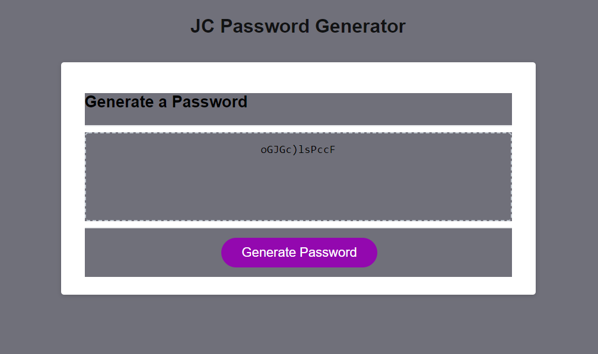

# m3c_javascript
This is a password generator I built. It takes multiple paramters set by the user and outputs a password within those specs. It uses a full alphabet(upper and lowercase), numbers(1-9, i excluded 0 by choice) and a few special characters.

[Check it out here!]()